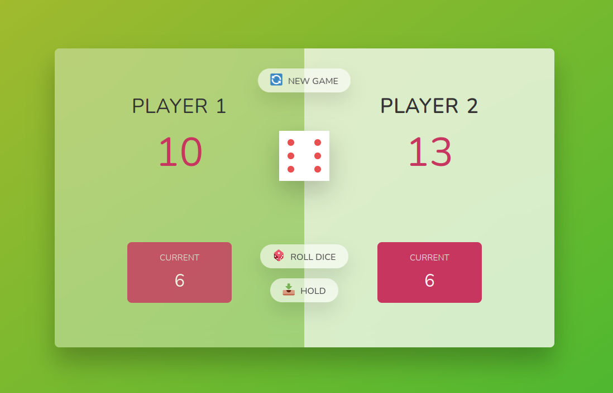

# Pig Game




## Table of Contents

- [Introduction](#introduction)
- [Game Rules](#game-rules)
- [Technologies Used](#technologies-used)
- [Getting Started](#getting-started)
- [Code snippet](#Technologies-Used)
- [Highlights](#highlights)
- [Contributing](#contributing)
- [License](#license)

## Introduction

Welcome to the Pig Game, a simple dice game where two players take turns rolling a single die. The goal is to be the first player to reach a set total score. However, be careful! If you roll a 1, you lose your current score, and it's the next player's turn. Use strategy and a bit of luck to win the game!

## Game Rules

1. Players take turns rolling a six-sided die.
2. The player can roll the die as many times as they want in a single turn.
3. If a player rolls a 1, their current score is lost, and it's the next player's turn.
4. The player can choose to "Hold," which adds their current score to their total score, and it becomes the next player's turn.
5. The first player to reach a specified total score (e.g., 20) wins the game.

## Technologies Used

- HTML
- CSS
- JavaScript

## Code Snippet

Here is an example of how the dice rolling functionality is implemented in JavaScript:

javascript

// roling button functionality
btnRoll.addEventListener('click', function () {
  if (playing) {
    // 1. Generate a random dice roll, from 1 to inc. 6
    const dice = Math.trunc(Math.random() * 6) + 1;
    console.log(dice);

    // 2. display dice
    diceEl.classList.remove('hidden');
    diceEl.src = `dice-${dice}.png`; //display image according to dice number

    // 3. check for rolled 1: if true, switch to next player
    if (dice !== 1) {
      // add dice to current score
      currentScore += dice; //add dice to current score
      document.getElementById(`current--${activePlayer}`).textContent =
        currentScore;
      current0El.textContent = currentScore; //Change later
    } else {
      //switch to next player /-update- took it as an function
      switchPlayer();
    }
  }
});

## Getting Started

To play the Pig Game locally, follow these steps:

1. Clone the repository to your local machine:

   ```bash
   git clone https://github.com/your-username/pig-game.git
